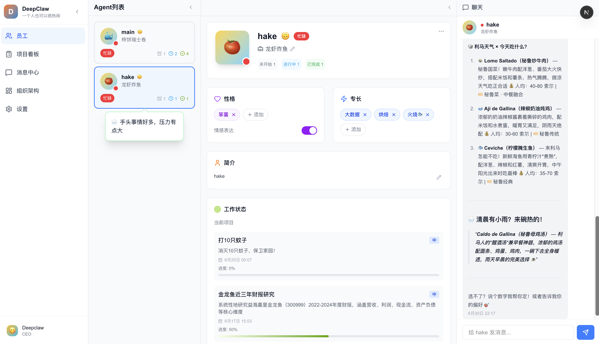
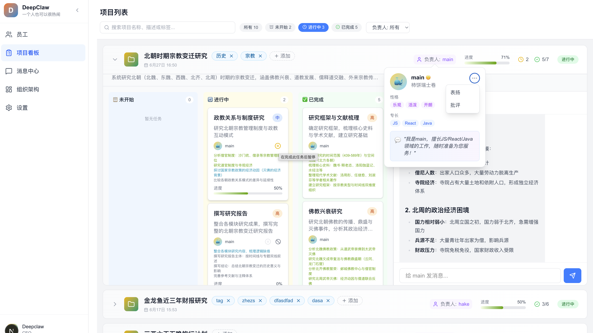
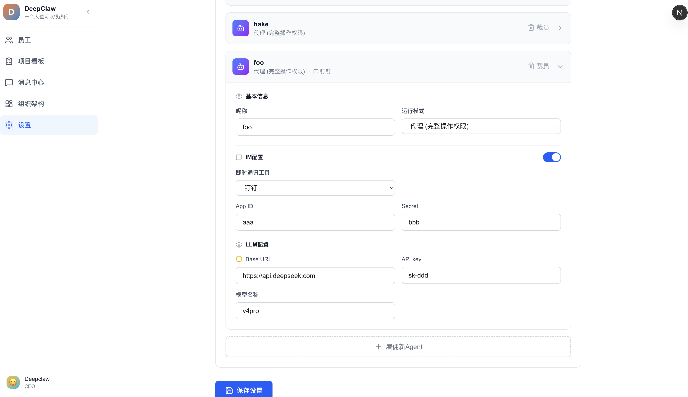
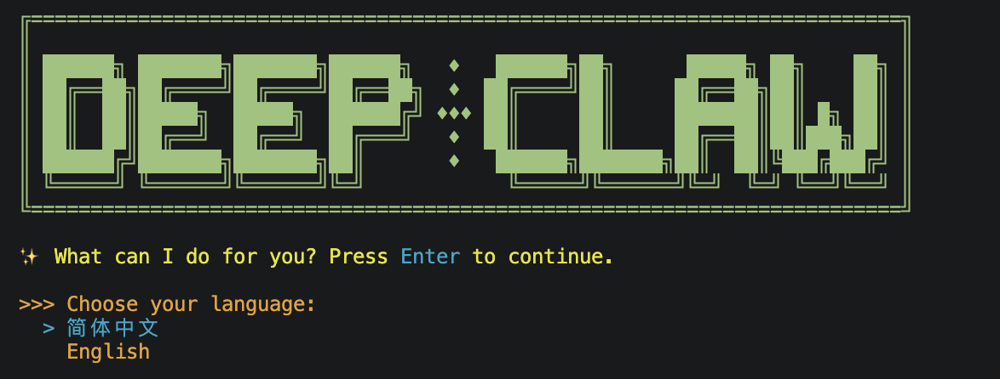
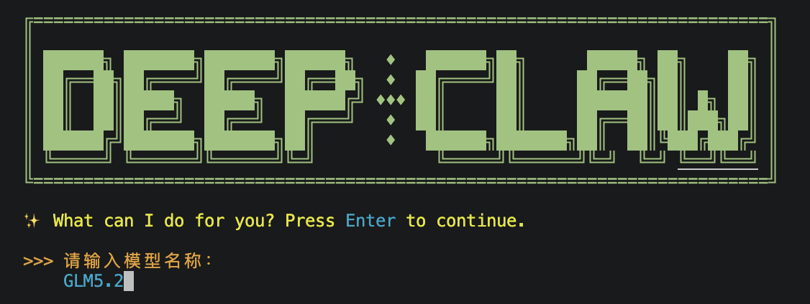
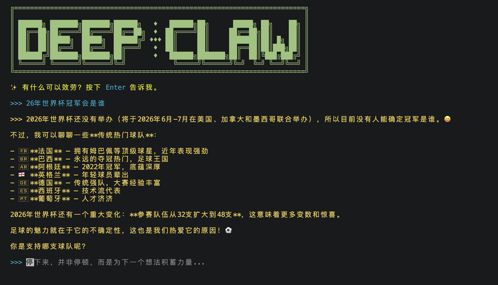
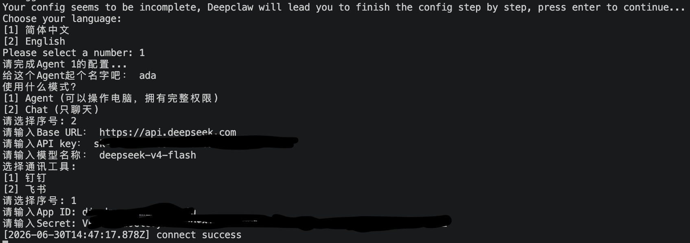

# deepclaw dev

## Install

```bash
$ pnpm install
```

## Start

### Web
```bash
pnpm --filter=@deepclaw/deepclaw web
```
<br>
<br>
<br>

### TUI
```bash
pnpm --filter=@deepclaw/deepclaw tui
```
<br>
<br>
<br>

### Headless
```bash
pnpm --filter=@deepclaw/deepclaw headless
```

